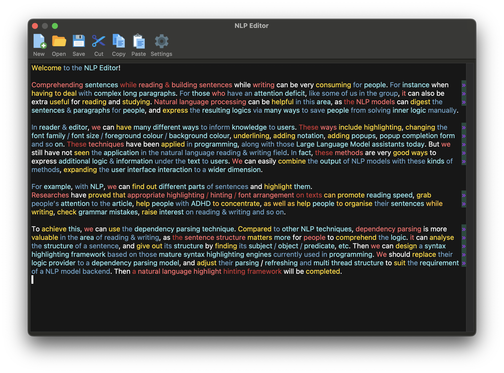
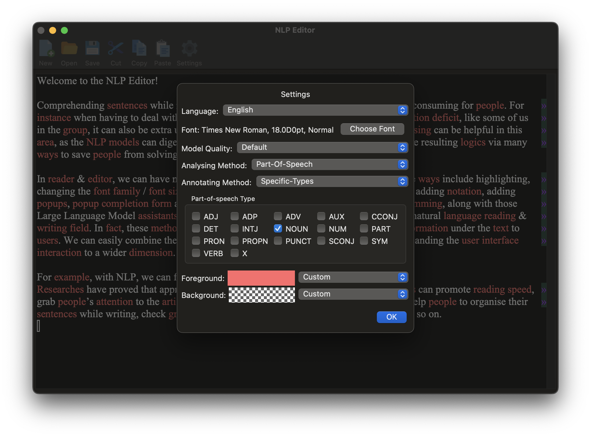
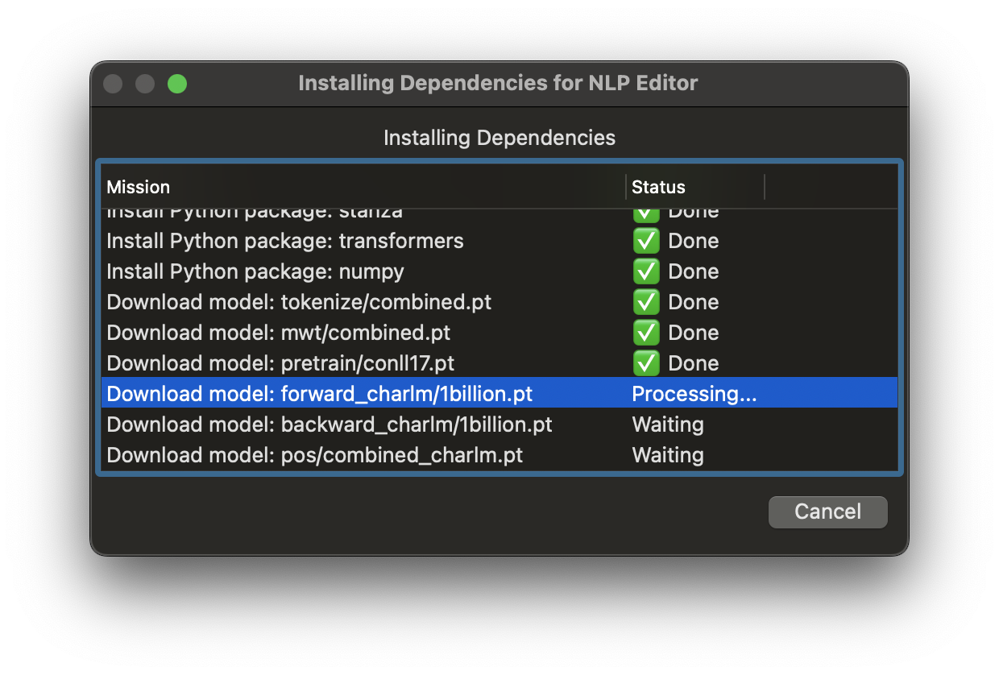
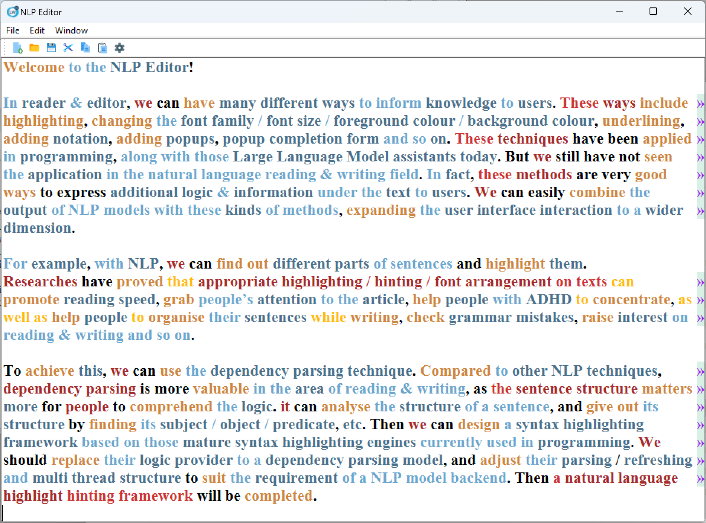

# NLP Editor

Experimental editor combining NLP facility. Pre-alpha stage.

Current functions:

- Natural language highlighting by dependency relationships / part-of-speech / named entities

[Click here to install the newest version](https://github.com/apr3vau/nlpedit/releases)

## Requirements

For Windows user, this application needs [Visual C++ library](https://aka.ms/vs/17/release/vc_redist.x64.exe) to run.
Please download and install if you don't have it.

### macOS

For macOS user, the application has not signed yet, so you need some manual procedure to make it run.

Assuming you've installed the application at `/Applications/nlpedit.app`, execute the following command in macOS `Terminal`:

	xattr -d com.apple.quarantine /Applications/nlpedit.app

Open the application, choose "Trust" in the Privacy settings, then the application should start. Tested under macOS Sonoma.

## Screenshots

### Natural Language Highlighting

### Configuration Panel

### Dependency Installer

### Light theme on Windows

## Acknowledgements

We use [stanza](https://github.com/stanfordnlp/stanza/) for NLP backend.

The application is built with [LispWorks](www.lispworks.com).

We use free icons from [icons8](https://icons8.com) for our application.

Supporting Neurodiversity & Transgender & Plurality!

🏳️‍🌈🏳️‍⚧️
